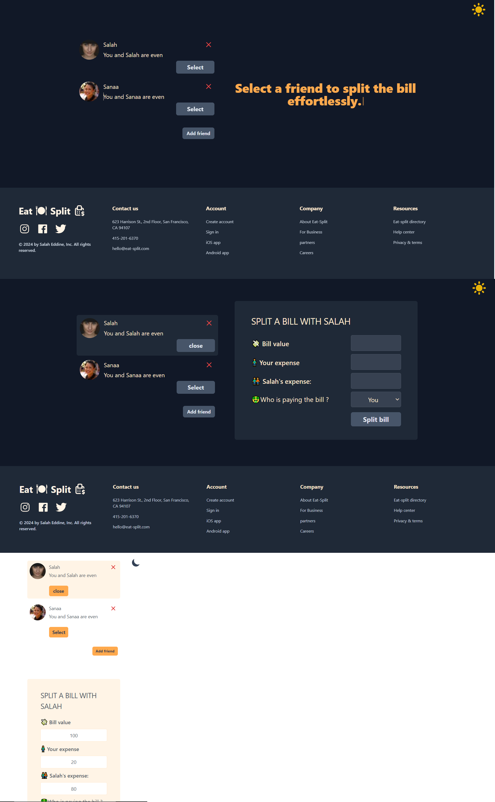

# Eat & Split

### Modern React Application for Splitting Bills with Friends

---

## Table of Contents

- [Overview](#overview)
- [Features](#features)
- [Technologies](#technologies)
- [Deployment](#deployment)
- [Author](#author)

---

## Overview

Eat & Split is an interactive React application designed to simplify bill splitting among friends. The app allows users to add friends, select who to split the bill with, and track who owes whom money. It features a modern, user-friendly interface with dark mode toggling and an engaging typing animation.

## 

## Features

- **Friend Management**: Add and manage friends in the application.
- **Delete Friend**: Remove friends from the list with a confirmation alert for added security.
- **Bill Splitting**: Easily split bills and track who owes what.
- **Dark Mode Toggle**: Seamless switch between light and dark themes using a custom hook (`useDarkMode`).
- **Typing Animation**: Engaging title animation for enhanced user experience.
- **Custom Hooks**:
  - `useDarkMode`: Manage dark mode state and theme switching.
  - `useLocalStorage`: Persist data such as friends and settings in local storage.
- **Responsive Design**: Fully responsive across all devices, providing an optimized experience on mobile, tablet, and desktop.

---

## Technologies

- **React** (with Hooks: `useState`, `useEffect`, and custom hooks)
- **React Icons** for intuitive iconography
- **Tailwind CSS** for modern, responsive styling
- **JavaScript** for core functionality
- **Vite** for fast builds and development

---

## Deployment

# [Eat & Split Application](https://eat-split-salah-az.netlify.app/)

---

## Author

- Salah Eddine Ait Zenni
- GitHub: [salaheddineaz47](https://github.com/salaheddineaz47)

---

Feel free to reach out if you have any questions or suggestions!
