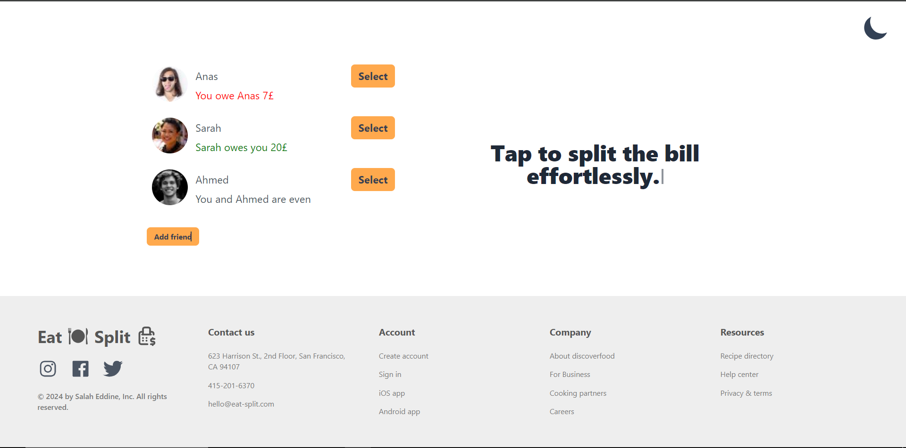

# Eat & Split

### Modern React Application for Splitting Bills with Friends

---

## Table of Contents
- [Overview](#overview)
- [Features](#features)
- [Technologies](#technologies)
- [Deployment](#deployment)
- [Author](#author)

---

## Overview
Eat & Split is an interactive React application designed to simplify bill splitting among friends. The app allows users to add friends, select who to split the bill with, and track who owes whom money. It features a modern, user-friendly interface with dark mode toggling and an engaging typing animation.

## 

## Features

- **Friend Management**: Add and manage friends in the application.
- **Bill Splitting**: Easily split bills and track who owes what.
- **Dark Mode Toggle**: Seamless switch between light and dark themes.
- **Typing Animation**: Engaging title animation for enhanced user experience.
- **Responsive Design**: Optimized for various device sizes.

---

## Technologies

- **React** (with Hooks: `useState`, `useEffect`)
- **React Icons** for intuitive iconography
- **Tailwind CSS** for modern, responsive styling
- **JavaScript** for core functionality
- **Vite** for fast builds and development

---

## Deployment

# [Eat & Split Application](https://eat-split-salah.netlify.app/)

---

## Author

- Salah Eddine Ait Zenni
- GitHub: [salaheddineaz47](https://github.com/salaheddineaz47)
---

Feel free to reach out if you have any questions or suggestions!
